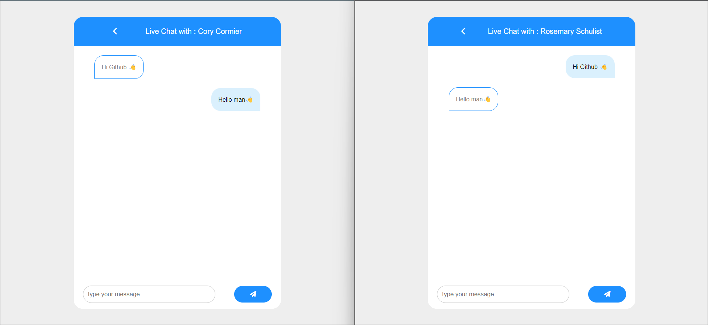
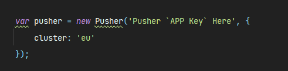

# Real-Time Chat With Laravel and Pusher



## Pre-start requirements
- Signup In [Pusher](https://pusher.com/) or login if u has an email
- Then Create Your Channel In [Pusher](https://pusher.com/)

## Config
- Go to `env` File
- Replace The Following Code  With Pusher Given Cardinalities
```
PUSHER_APP_ID=
PUSHER_APP_KEY=
PUSHER_APP_SECRET=
```
- Put Your DB Information 
```
DB_DATABASE='Your-DB-NAME'
DB_USERNAME='DB-Username'
DB_PASSWORD='DB-Password'
```
- Then Go To Script In `Chat Blade`
- Put Your Pusher `APP Key` There



## Run Commands
```
php artisan migrate --seed 

php artisan serve
```

## Notes
> - Every User Password is 123456789
> - Both User Should Be Online at Same Time to Chatting
> - You Can Achieve The Prev Note By Open One User On Google `Normal Mode` another in `Incognito`

## Wanna Help ?
- How To Use Chat [Video]() In Linked in  
